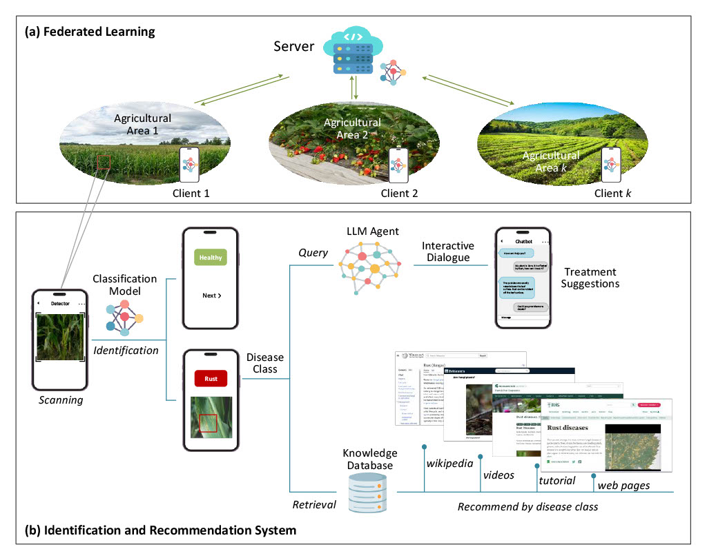

# AGRIFOLD-AGRIculture-Federated-Learning-for-Optimized-Leaf-Disease-detection

## Abstract
Efficient and accurate detection of plant leaf diseases is crucial for safeguarding crop health and ensuring agricultural sustainability. However, the decentralized nature of agricultural data and the limitations of centralized Machine Learning (ML) pose significant challenges to building scalable and privacy-preserving solutions. This paper presents AGRIFOLD, a Federated Learning (FL) framework that enables collaborative training of a lightweight Convolutional Neural Network (CNN) across diverse and distributed datasets while preserving data privacy. By integrating an Efficient Channel Attention (ECA) mechanism into the VGG16 architecture, AGRIFOLD enhances classification accuracy and interpretability through heatmaps that highlight diseased leaf regions. The model’s lightweight design, optimized via ablation and pruning techniques, ensures deployment on resource-constrained edge devices. To further support farmers, the framework includes a recommender powered by natural language processing to suggest tailored treatments. Evaluations using 12 heterogeneous datasets demonstrate high classification accuracy across nine leaf disease classes and the healthy class, showcasing the potential of FL-based solutions for real-world agricultural applications.

## Acknowledgments
This work was supported by: 
- PNRR Centro Nazionale HPC, Big Data e Quantum Computing, (CN$_$00000013) (CUP: E63C22000980007), Innovation Fund: SESG, under the NRRP MUR program funded by the NextGenerationEU.
\bullet G.A.N.D.A.L.F. - Gan Approaches for Non-iiD Aiding Learning in Federations, CUP: E53D23008290006, PNRR - Missione 4 “Istruzione e Ricerca” - Componente C2 Investimento 1.1 “Fondo per il Programma Nazionale di Ricerca e Progetti di Rilevante Interesse Nazionale (PRIN)”.
