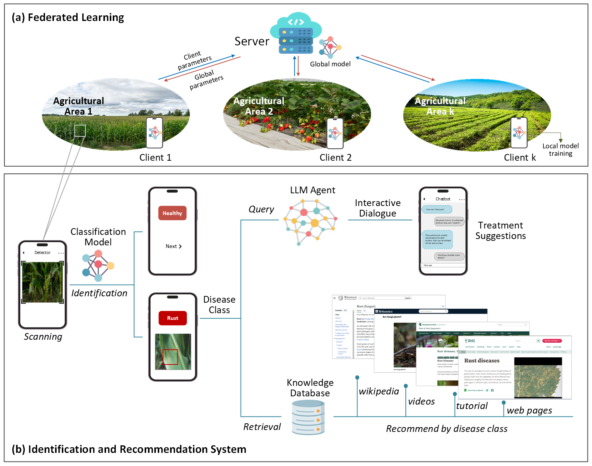

# AGRIFOLD-AGRIculture-Federated-Learning-for-Optimized-Leaf-Disease-detection

## Abstract
Efficient and accurate detection of plant leaf diseases is essential for protecting crop health and promoting sustainable and precision agriculture practices. However, the decentralized nature of agricultural data, combined with the inherent limitations of centralized Machine Learning (ML), presents significant challenges for developing scalable, privacy-preserving solutions. In this paper, we introduce AGRIFOLD, a Federated Learning (FL) framework designed to enable collaborative training of a lightweight Convolutional Neural Network (CNN) across diverse and distributed datasets while maintaining data privacy. By integrating an Efficient Channel Attention (ECA) mechanism into the VGG16 architecture, AGRIFOLD significantly improves classification accuracy and enhances interpretability through heatmaps that highlight regions affected by diseases. \textcolor{blue}{We evaluate the FL model using various aggregation methods, including FedAvg, FedProx, SCAFFOLD, FedBN, and FedDF, obtaining good accuracy levels for all tested aggregation strategies, with SCAFFOLD achieving the best overall performance}. The model’s lightweight design, optimized through ablation and pruning techniques, facilitates deployment on resource-constrained edge devices. Additionally, to further support farmers' decision-making, the framework incorporates a natural language processing-based recommender system that provides tailored treatment suggestions. Comprehensive experiments conducted on 12 heterogeneous datasets demonstrate high classification accuracy across 9 distinct leaf disease classes and healthy leaves, underscoring the practical potential of FL-based solutions for sustainable, real-world agricultural applications.



## Table of Contents
- [Overview](#overview)
- [Data Availability](#data-availability)
- [Installation](#installation)
- [Preprocessing](#preprocessing)
- [Training](#training)
  - [Hardware Infrastructure](#hardware-infrastructure)
  - [Preliminary operations](#preliminary-operations)
  - [FL Training](#fl-training)
- [Heatmaps Generation](#heatmaps-generation)
- [Web Scraping](#web-scraping)
- [Chatbot](#chatbot)
- [Acknowledgments](#acknowledgments)

## Overview
The project implements a complete pipeline for optimized leaf disease detection, including:

- **Data Preprocessing**: All datasets are preprocessed to ensure consistency and quality. This includes resizing images to a fixed resolution of 224x224 and normalizing pixel values within the range $[0,1]$.
- **FL Training**: The Flower framework is used to coordinate decentralized training across multiple clients. This setup supports diverse environments, making the approach scalable and suitable for agricultural deployments on mobile or edge devices.
- **Heatmaps Generation**: Creation of heatmaps to visualize the regions of diseased leaves.
- **Web Scraping**: Scraping of treatment information from the web to provide recommendations.
- **Chatbot**: A conversational agent that assists users in interacting with the system, providing information and answering queries related to leaf disease detection and treatment.

## Data Availability
Image datasets used in this study are from various free available sources. To create a realistic simulation of the FL scenario, we selected datasets representing various plant diseases from different regions worldwide.

Below is the list of datasets used in the experiments:

- **[Apple Tree Leaf Disease Segmentation Dataset:](#)**  
   apple leaf disease images, collected in four different zones in Northwest China, using a Glory V10 mobile phone. Images with different degrees of disease were taken in the laboratory and in real cultivation fields, under different weather conditions and at different times of the day. Selected classes from this dataset are brown spot, rust, and healthy.  
  🔗 Download: [https://www.scidb.cn/en/detail?dataSetId=0e1f57004db842f99668d82183afd578](https://www.scidb.cn/en/detail?dataSetId=0e1f57004db842f99668d82183afd578)

- **[Corn Leaf Disease:](#)**  
   corn leaf images collected in Indonesia. The image data was captured using a mobile phone camera with a resolution of 16 MegaPixels, placing white paper behind the corn leaves. The images were taken 5 times for each corn leaf, during daytime (12 PM - 2 PM WIB) to ensure good lighting conditions. There are 4 classes in the data: healthy, leaf blight, leaf spot, and leaf rust. Each class contains 1000 images. We selected healthy and leaf rust classes.  
  🔗 Download: [https://www.kaggle.com/datasets/ndisan/corn-leaf-disease?select=Daun+Sehat](https://www.kaggle.com/datasets/ndisan/corn-leaf-disease?select=Daun+Sehat)

- **[Dataset of Tomato Leaves:](#)**  
    this dataset is divided into two datasets for tomato leaf images according to different image sources. The tomato leaf images of the first dataset are selected from the PlantVillage dataset. Each image is composed of a single leaf and a single background, for a total of 14531 images. The second dataset is composed of images of Taiwanese tomato leaves, with six classes (five disease classes and one health). It consists of a single leaf, multiple leaves, a single background, and a complex background. From the second dataset, we selected bacterial spot, early blight, late blight, powdery mildew, and the healthy classes.  
  🔗 Download: [https://data.mendeley.com/datasets/ngdgg79rzb/1](https://data.mendeley.com/datasets/ngdgg79rzb/1)

- **[Indigenous Dataset for Apple Leaf Disease Detection and Classification:](#)**  
   apple leaf images collected in the Jammu and Kashmir region. The dataset contains 7569 images belonging to healthy, alternaria, and mosaic classes. We selected only the healthy and mosaic classes.
  🔗 Download: [https://data.mendeley.com/datasets/9m2dcb5mmr/3](https://data.mendeley.com/datasets/9m2dcb5mmr/3)

- **[JMUBEN 3:](#)**  
     potato leaf images collected in Kenya using a digital camera and with the help of plant pathologists for easy disease identification. The dataset contains 1383 images affected by rust.  
  🔗 Download: [https://data.mendeley.com/datasets/jjn4ht687d/4](https://data.mendeley.com/datasets/jjn4ht687d/4)

- **[PlantDoc:](#)**  
    2598 images across 13 plant species and up to 17 classes of diseases. We select the following diseases, which do not belong to all plant species: Bacterial spot, black rot, early blight, late blight, mosaic, powdery mildew, rust, yellow, and healthy.  
  🔗 Download: [{https://github.com/pratikkayal/PlantDoc-Dataset/blob/master/README.md]({https://github.com/pratikkayal/PlantDoc-Dataset/blob/master/README.md)

- **[PlantVillage:](#)**  
    61486 plant leaf and background images belonging to 39 different classes. We selected the following 8 classes: Bacterial spot, Black rot, early blight, late blight, mosaic, powdery mildew, yellow, and healthy.  
  🔗 Download: [https://data.mendeley.com/datasets/tywbtsjrjv/1](https://data.mendeley.com/datasets/tywbtsjrjv/1)

- **[Potato Disease Leaf Dataset (PLD):](#)**  
    4062 images collected from the Central Punjab region of Pakistan. Disease classes in this dataset are early blight, late blight, and healthy.  
  🔗 Download: [https://www.kaggle.com/datasets/rizwan123456789/potato-disease-leaf-datasetpld](https://www.kaggle.com/datasets/rizwan123456789/potato-disease-leaf-datasetpld)

- **[Potato Leaf (Healthy and Late Blight):](#)**  
    potato leaf images collected in Ethiopia from two plant pathologists, in various noisy environments, using a high-resolution digital camera and smartphone. Late blight class comprises 63 images and Healthy class comprises 363 images.  
  🔗 Download: [https://data.mendeley.com/datasets/v4w72bsts5/1](https://data.mendeley.com/datasets/v4w72bsts5/1)

- **[Rice Leaf Disease Image:](#)**  
    5932 images encompassing four types of rice leaf diseases: bacterial blight, blast, brown spot, and tungro. We only select the brown spot class.
  🔗 Download: [https://www.kaggle.com/datasets/nirmalsankalana/rice-leaf-disease-image](https://www.kaggle.com/datasets/nirmalsankalana/rice-leaf-disease-image)

- **[Sugarcane Leaf Disease:](#)**  
    sugarcane leaf images captured with various smartphones in India. It contains 2569 images including 5 disease classes: healthy, mosaic, redrot, rust, and yellow. We selected all classes except the redrot class.
  🔗 Download: [https://data.mendeley.com/datasets/9424skmnrk/1](https://data.mendeley.com/datasets/9424skmnrk/1)

- **[Sugarcane Leaf Images:](#)**  
    7134 high-resolution images of sugarcane leaves, categorized into 12 distinct classes, including 10 disease classes, a healthy leaves class, and a dried leaves class. These images were collected capturing different angles and stages of the disease. We selected brown spot, yellow, and healthy classes.
    🔗 Download: [https://data.mendeley.com/datasets/9twjtv92vk/1](https://data.mendeley.com/datasets/9twjtv92vk/1)


## Installation
### 1. **Clone the repository:**
   
```bash
git clone https://github.com/MODAL-UNINA/AGRIFOLD.git
cd AGRIFOLD
```
### 2. **Set up the environment:**
 Create a Conda environment directly from the provided environment_torch.yaml file and activate it by running:  
```bash
conda env create -f Scripts/Files_yaml/environment_torch.yaml
conda activate agrifold
```

## Preprocessing
To preprocess the datasets, run the following command:

```bash
python -u Scripts/Preprocessing/Preprocessing.py
```

## Training

### Hardware Infrastructure
The experiments were conducted on a multi-node server setup utilizing the Infrastructure for Big Data and Scientific Computing (I.BI.S.CO) at the S.Co.P.E. Data Center, University of Naples Federico II .

### Preliminary operations
In order to execute the codes on the S.Co.P.E. infrastructure, the necessary .sh files must be created:

#### 1. `run_fl_inner.sh`
This script is executed once per SLURM task and plays the dual role of **server** (task 0) or **client** (tasks > 0) in the federated‑learning experiment.

#### 2. `launch_fl.sh`
This code orchestrates the parallel launch of `run_fl_inner.sh` across all allocated nodes.

### FL Training
To run the FL simulation, execute the following commands:

```bash
salloc -p gpus --nodes=3 --ntasks-per-node=4 --gpus-per-task=1 --time=48:00:00 -J name_launch

mkdir runs/$SLURM_JOB_ID

bash launch_fl.sh
```

This script performs the following operations:
- **salloc**: Allocates resources for the job, specifying the number of nodes, tasks per node, and GPUs per task.
- **mkdir**: Creates a directory to store the results of the current job.
- **bash launch_fl.sh**: Executes the federated learning training process across the allocated nodes.

## Heatmaps Generation
After completing FL training, you can produce **class‑activation heatmaps** that visualize the regions most influential to each client model’s prediction. To generate heatmaps, run the following command:

```bash
python -u Scripts/FL/heatmaps.py
```
## Web Scraping
To scrape treatment information from the web, execute the following command:

```bash
python -u Scripts/Recommendations/web_scraping.py
```

## Chatbot
To run the chatbot, execute the following command:

```bash
python -u Scripts/Recommendations/chatbot.py
```


## Acknowledgments
This work was supported by: 
- PNRR Centro Nazionale HPC, Big Data e Quantum Computing, (CN$_$00000013) (CUP: E63C22000980007), Innovation Fund: SESG, under the NRRP MUR program funded by the NextGenerationEU.
- G.A.N.D.A.L.F. - Gan Approaches for Non-iiD Aiding Learning in Federations, CUP: E53D23008290006, PNRR - Missione 4 “Istruzione e Ricerca” - Componente C2 Investimento 1.1 “Fondo per il Programma Nazionale di Ricerca e Progetti di Rilevante Interesse Nazionale (PRIN)”.
